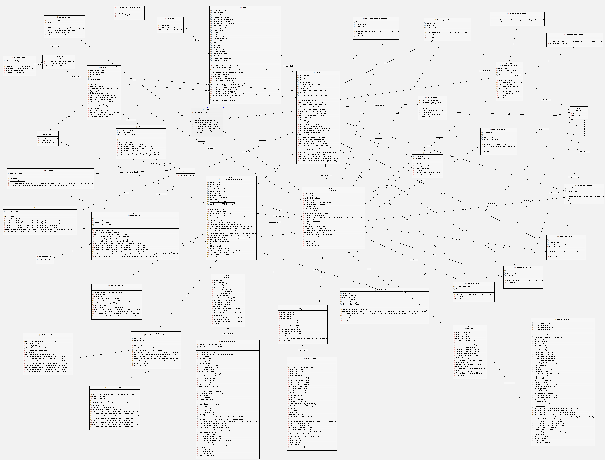
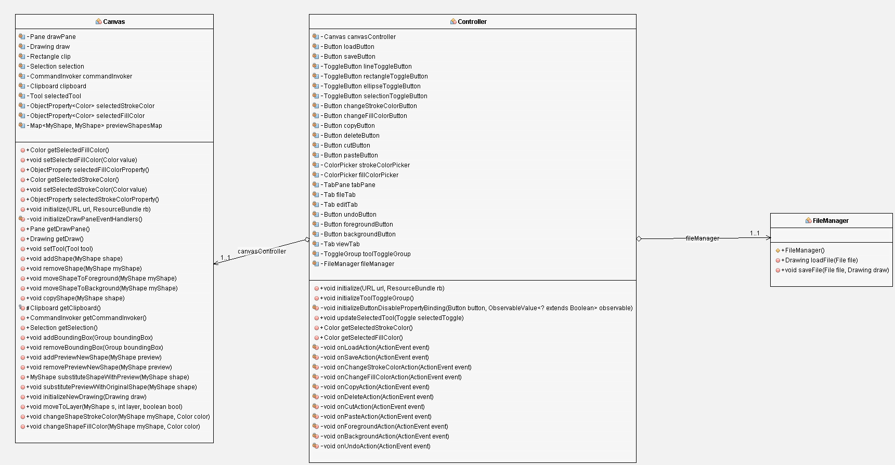

# Drawing-Program-SE-Project-2022-Group-11

## Name

Our Drawing Application

## Description

An application implementing a geometric drawing program

A first interface prototype of our Application is shown in the following image

## Links

Our links:
- To access to our Bacheca Trello click [here](https://trello.com/b/aSnWUSzm/scrum-board)
- To access to our Product Backlog click [here](https://docs.google.com/spreadsheets/d/1XaCnBN4cuR05TMK2ExlH_ur3wS84wBuVe6LEqrFkWdg/edit?usp=sharing)

## Artifacts

### Pre Game
- Presentation: [here](https://docs.google.com/presentation/d/1mczWfrO8wgZxh7Jv2azd6XbFVH4oPk6M/edit?usp=sharing&ouid=105558939372302535971&rtpof=true&sd=true)

### First sprint
- First sprint review: [here](https://drive.google.com/file/d/1kzPZya06rCov1XQGVv6PKCGH1UrXnhEK/view?usp=share_link)
- First sprint retrospective: [here](https://drive.google.com/file/d/1XCqZpSGd7vfCF4IWIQ2-gHt4rI5Vd_pc/view?usp=share_link)
- First sprint presentation: [here](https://docs.google.com/presentation/d/1fg_xuNFmkkGwHWoYH_QkB26NzK0zvgQo/edit?usp=share_link&ouid=105558939372302535971&rtpof=true&sd=true)

### Second sprint
- Second sprint review: [here](https://drive.google.com/file/d/16FK71nFWW5xf6ty0dU_jtUSLsRjra-xs/view?usp=share_link)
- Second sprint retrospective: [here](https://drive.google.com/file/d/1MAh2XiBMZ3jck56kujj62Rs3hDJVb-bA/view?usp=share_link)
- Second sprint presentation: [here](https://docs.google.com/presentation/d/1bIblsFKZl6yTlqgXiA2HSsqbqMcLkdN2/edit?usp=share_link&ouid=105558939372302535971&rtpof=true&sd=true)

### Third sprint
- Third sprint review: [here](https://drive.google.com/file/d/18ZnR-9cOrDQwqpwD9B4JN756pZJppy_o/view?usp=share_link)
- Third sprint retrospective: [here](https://drive.google.com/file/d/13uaZNAkgWoO9SwXd2XTjZDgIgPIlew-4/view?usp=share_link)
- Third sprint presentation: [here](https://docs.google.com/presentation/d/1Ik8e0MhZpCHyETvTuoDMSiPUCKihVo0O/edit?usp=share_link&ouid=105558939372302535971&rtpof=true&sd=true)

### Final project
- Video: [here](https://drive.google.com/file/d/1BuamNKJm4fvrLoWSffg-2j9bYr9Q_xtn/view?usp=share_link)

## UML Class Diagram
- Project UML overview

- Project UML per package view

## Definition of Done

- The user story must be fully implemented
- Acceptance criteria met
- Unit/Integration of functionality successfully tested
- Code must be commented
- Javadoc must be produced for each module
- Functionality must be committed and pushed to remote repository

## Authors

| Author | Id | E-mail |
| ------ | ------ | ------ |
| Iovaro Damiana | 0622702017 | d.iovaro@studenti.unisa.it |
| Massaro Sara | 0622702015 | s.massaro3@studenti.unisa.it |
| Scala Felice | 0622702002 | f.scala14@studenti.unisa.it |
| Trotta Prisco | 0622702014 | p.trotta12@studenti.unisa.it |
